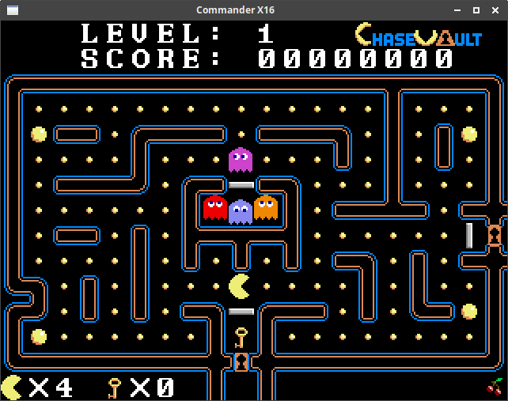

# x16-chasevault
Chase Vault: A new game for the Commander X16 retrocomputer.

Too build PRG file, run **build.sh** in bash (Git bash is recommended for Windows).

Build requirements: gcc, cc65

Please note at this time that the game is not yet
playable.  The current build will simply generate the initial screen and not respond to any input.
